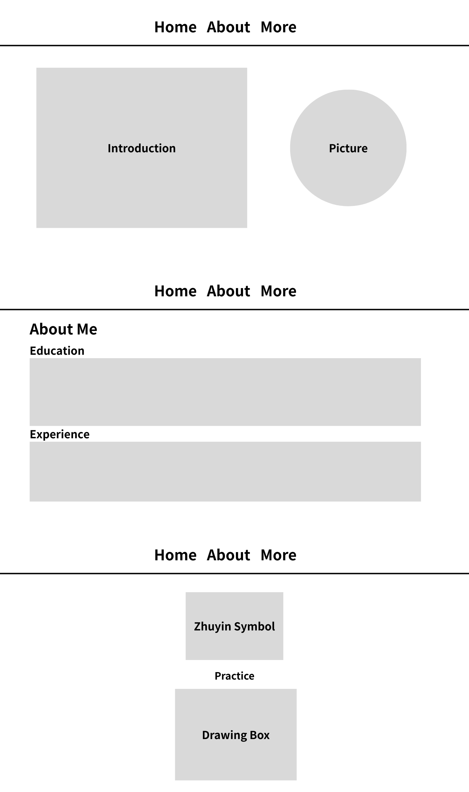

## Project description

    - This is a personal homepage created by a student to introduce myself, my education, and my interests. The purpose of this website is to provide visitors with a clear and professional overview of who I am, what I am learning, and what I plan to work on in the future. Visitors can learn about my background, skills, and contact me if they want to collaborate or connect.

## User Personas

    - Name: Emma Hudson
    - Role: HR Recruiter at a tech company
    - Goals:
        - Quickly understand the candidate’s background and potential
        - See evidence of skills and learning progress
        - Decide whether to forward the candidate to the hiring manager
    - Frustrations:
        - Too much unclear or irrelevant information
        - No clear skills or evidence of work
        - Hard to find contact information or resume

## User stories (use cases but with a story)

    - As an HR recruiter, I want to view the candidate’s skills, so that I can quickly evaluate whether they match the job requirements.
    - As an HR recruiter, I want to see the candidate’s projects or learning progress, so that I can understand their real abilities and potential.
    - As an HR recruiter, I want to find contact information easily, so that I can reach out if I want to schedule an interview.
    - As a beginner Mandarin learner, I want to practice Zhuyin symbols interactively, so that I can become more familiar with their forms and usage.

## Design mockups

## Creative Addition

    - The homepage includes a countdown timer feature.
    - It counts down to a future event (e.g., graduation, project deadline, etc.).
    - It updates every second using JavaScript.
    - It helps show dynamic content and demonstrates interactive web design.
    - This feature is original and makes the homepage more engaging.
