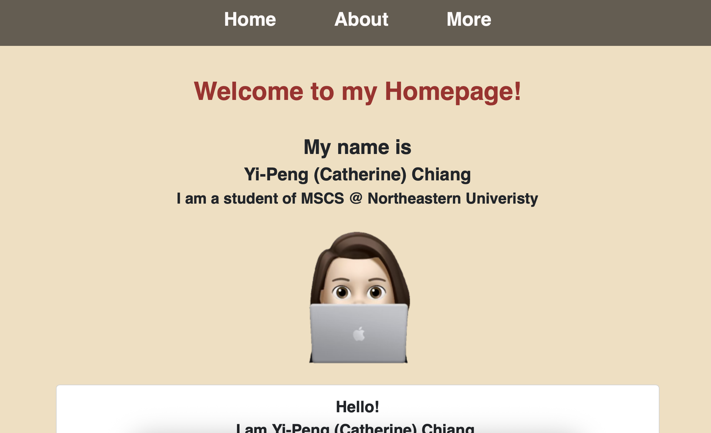

## Author
**Yi-Peng Chiang**
Master’s student in Computer Science, Northeastern University

## Class link
[CS5610 - Web Development (Spring 2026)](https://johnguerra.co/classes/webDevelopment_online_spring_2026/)

## Project Objective
This is a personal homepage designed to introduce myself, showcase my background, skills, and interests.  
It includes interactive features such as a Zhuyin symbol learning and writing practice page, and a Spring Break countdown.

## Screenshot of the Website

## Instruction to Build
This is a static website hosted on GitHub Pages.  
You can access it directly here:

https://catcatchiang.github.io/CS5610-Project-1/

## Describe any use of GenAI
This project used ChatGPT (OpenAI) to help build the Zhuyin practice page.

- Tool used: ChatGPT

- Model: GPT-4o

- How it was used:
ChatGPT assisted in writing and improving the JavaScript and CSS for the Zhuyin learning and drawing canvas feature.

- Prompt used:
1. “Please help me write a Zhuyin learning page with a random symbol display and a drawing canvas that works on desktop and mobile. Use ES6 modules and make the background symbol semi-transparent.”
2. “How can I make the drawing canvas work on tablet and mobile touch devices?”
3. “How can I keep the same Zhuyin symbol when I clear the canvas?”
4. “How can I display a larger transparent Zhuyin symbol in the background of the canvas?”

## License
This project is licensed under the MIT License.
